<p align="center">
  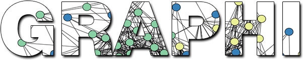

  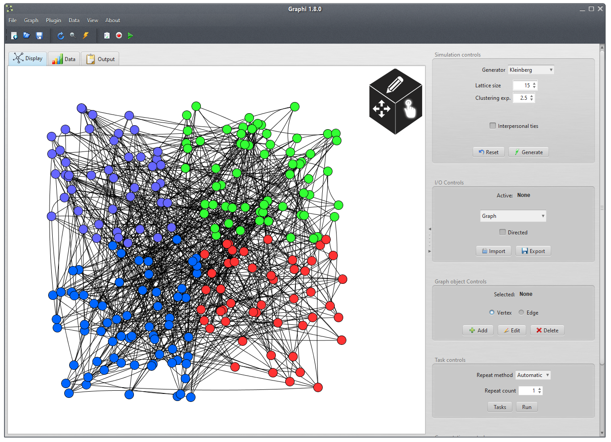
</p>

[](https://forthebadge.com)
[](https://forthebadge.com)

## About

### Table of Contents
- [Features](#features)
  * [Controlling Network Objects](#Controllingnetworkobjects)
  * [Network Recording & Playback](#Networkrecording)
  * [Network Simulation](#Networksimulation)
  * [Tasks](#Tasks)
  * [Projects](#Projects)
  * [Plugins](#Plugins)
  * [Settings](#Settings)
  * [Manage Network Objects](#Managenetworkobjects)
  * [Searching](#Searching)
  * [Data & Logging](#Datalogs)
  * [IO](#io)
  * [Network Computation](#Networkcomputation)
  
- [Getting started](#Gettingstarted)
  * [Prerequisites](#Prerequisites)
  * [Installation](#Installation)
  * [Building](#Building)
  
- [License](#License)

<a name="features" />

## Features

<a name="Controllingnetworkobjects" />

### Controlling Network Objects
The view of the graph pane can be easily manipulated using your mouse  
You can select, move objects, zoom in/out, rotate the graph and focus a node


The following example multi-node selection 

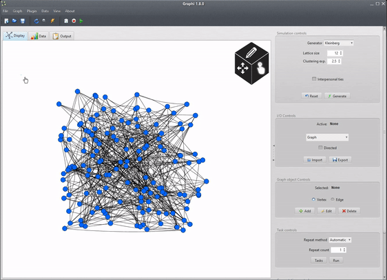

<a name="Networkrecording" />

### Network Recording & Playback
In Graphi you can record the state of a graph many times and create a _playback_  
All components can be recorded including node properties and data tables  
You can view specific entries, play & pause and change the speed of the playback  

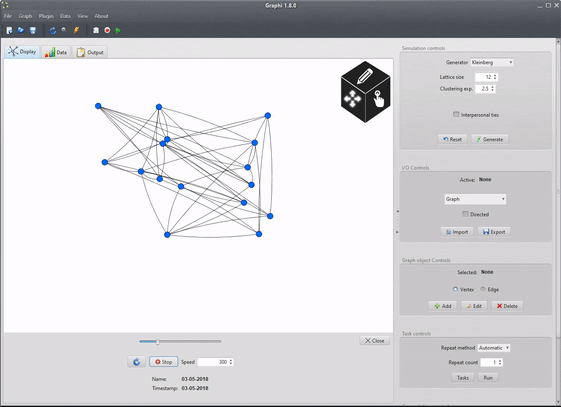

This feature is great for analysing network growth and behaviour  
For example one could observe diffusion/virus phenomenon  

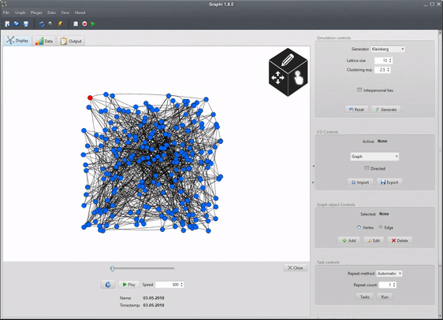

<br />

<a name="Networksimulation" />

### Network simulation

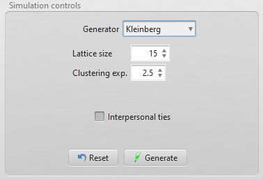

- Graphi offers a number of network generation algorithms to help simulate scale-free, small-world and random network topologies
- Supported algorithms include the [Kleinberg Model](https://en.wikipedia.org/wiki/Small-world_routing#The_Kleinberg_model), [Barabasi-Albert Model](https://en.wikipedia.org/wiki/Barab%C3%A1si%E2%80%93Albert_model) and [Erdos-Renyi Random Model](https://en.wikipedia.org/wiki/Erd%C5%91s%E2%80%93R%C3%A9nyi_model)
- Network simulations are highly configurable in the UI and script parameters
- Interpersonal ties can also be simulated using a probabalistic wiring mechanism  

<br />

<a name="Tasks" />

### Tasks

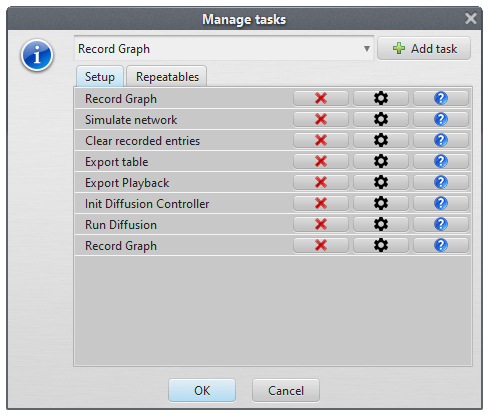

- Tasks save alot of time by offering a great way to combine commonly run operations, execute them multiple times and reuse them
- Many of the common Graphi operations such as network simulation, recording, exporting, computing etc. are available as tasks
- Users can add and execute _setup_ & _repeatable_ tasks where setup tasks can be used for example in experiment initialization and repeatables for operations that need to executed many times
- Operation parameters can be set individually for each specific task instance
- Users can create their own custom tasks using the comprehensive Graphi [Plugins](#Plugins) API

<br />

<a name="Projects" />

### Projects
Projects in Graphi are a users workspace, they maintain the users networks, table data, recordings etc.  
Users can create new projects, save them and open existing projects 

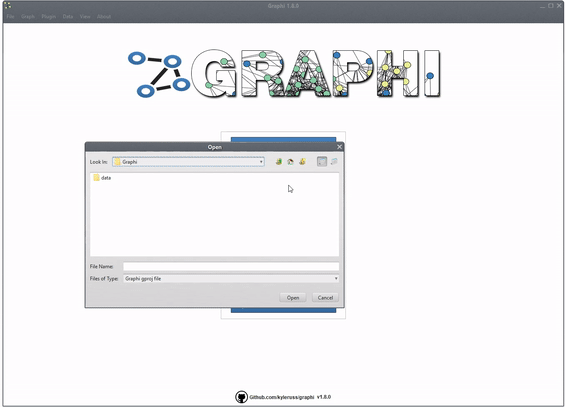

<a name="Plugins" />

### Plugins
Graphi allows users to users to extend the application using the Plugins API  
The Plugins API is very powerful and gives developers a lot of flexibility where the following is possible:
- Create new or change existing Graphi UI components i.e. skins 
- Create custom tasks
- Add new network simulation algorithms 
- Add new computation operations
- Create custom node and edges types with new states & variables
- Change mouse controls on the network view pane
- Change data views 
- Add new export & import options
- Many more

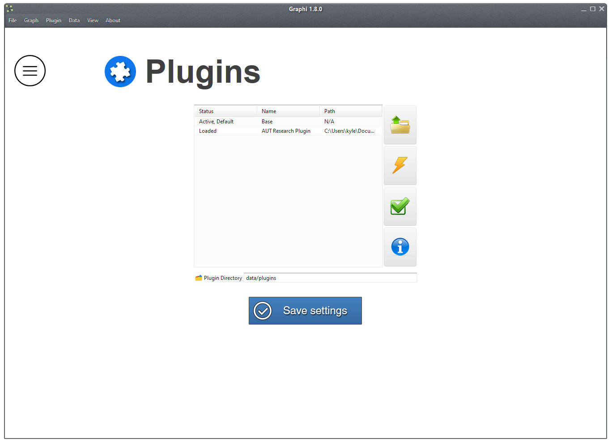

<a name="Settings" />

### Settings
Users can change many of the application settings from the options menu  
Visuals can be customization to preference such as node, edge, background colour as well as themes and resolution etc.
Additionally, network object labels and views can be toggled  
Users can also change logging and updating settings

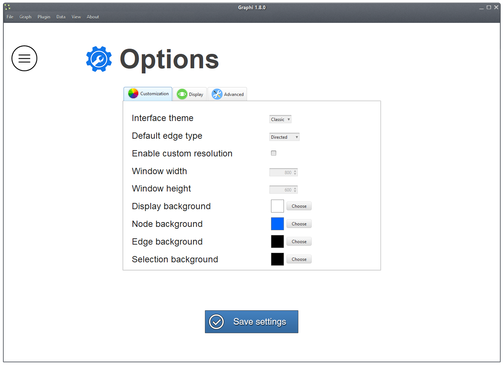

<a name="Managenetworkobjects" />

### Manage Network Objects

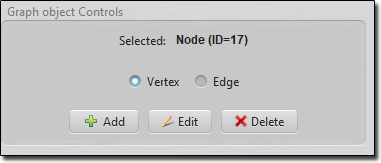

Graph objects such as nodes and edges can be managed from the _Graph Object Controls_  
Users can create a new node or edge from the `add` button or editing an existing object by selecting it and click `edit`
Objects can also be removed, simply select the object to removed click `delete` on the controls 

<a name="Searching" />

<br />

### Searching

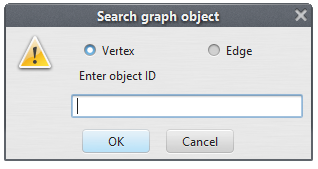

Users can search for nodes and edges using the object search feature  
If the node/edge is found it will by highlighted in the view pane  
Objects are searched by their ID, you can find an objects ID in the node/edge tables or by toggling object labels

<br />

<a name="Datalogs" />

### Data & Logging
Raw data in Graphi is represented in the _Data_ tables tab  
The tables include node, edge and computation data  
Additionally, some operations generate logs which you can find in the `Output` tab

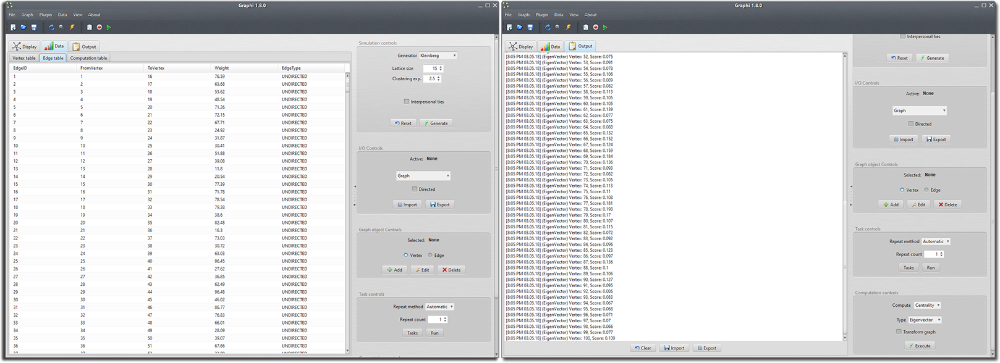

<a name="io" />

### IO

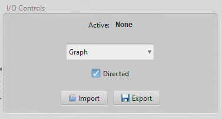

Graphi offers users a number of importing & exporting options  
Importing/exporting of the following objects and formats is supported:
- Networks (Supports Graphi .graph files, [GraphML](http://graphml.graphdrawing.org/), [GML](https://en.wikipedia.org/wiki/Graph_Modelling_Language), Matrices .txt)
- Network recordings 
- Data tables
- Tasks
- Logs

<a name="Networkcomputation" />

### Network Computation

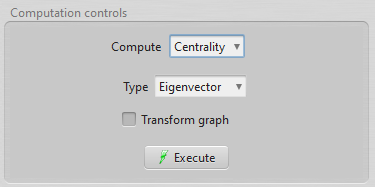

Graphi provides multiple network computation algorithms which can be applied on a network to analyse its behaviour  
Supported algorithms include centrality measures (eigenvector, closeness, betweenness) and computing clustering  
If enabled, algorithms are able to transform the network visually i.e. enlarging or coloring central nodes

<br />

<a name="Gettingstarted" />

## Getting started 

<a name="Prerequisites" />

### Prerequisites
- JDK 1.8
- Maven 3.3
- **Recommended:** NetBeans 8.1+

<a name="Installation" />

### Installation
- [Download](https://github.com/kyleruss/graphi/releases/latest) the latest release
- Unpack the zip contents 
- Run `Graphi.exe`

<a name="Building" />

### Building
- Clone the Graphi repository
```
git clone https://github.com/kyleruss/graphi.git
```

- Build the project 
```
mvn package
```

**Note:** The Graphi project can be directly imported into NetBeans


<a name="License" />

## License
Graphi is available under the MIT License  
See [LICENSE](LICENSE) for more details
